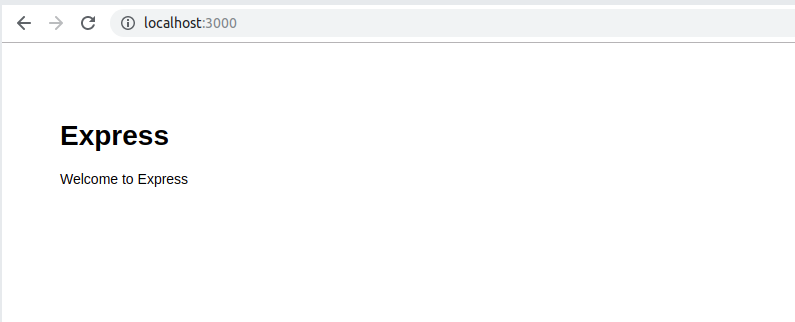

# Objectius d'aquest document 

- Introducció a docker infraestructure (Images & Containers).
- Instal·lació de l'entorn de docker.
- Muntatge d'una aplicació web feta en nodejs i express en un contenidor.

# Docker

Docker planteja un nou paradigme en el mon de la informàtica destinada al cloud. Docker planteja la possibilitat de tenir en una única màquina, o un únic ordinador, diferents aplicacions en marxa, realitzades amb diferents tecnologies i diferents llenguatges de programació.

L'objectiu és realitzar el muntatge de contenidors que gestionin independentment i de manera aliena al sistema operatiu cada una de les aplicacions que es vulguin tenir en marxa en l'ordinador. Els contenidors serveixen per gestionar l'aplicació en temps d'execució i permet desacoblar el codi, de l'execució del programa. 

Dividim els components de docker en diferents components :

- Imatges
- Contenidors
- Network
- Volums
- Clustering

En aquest document ens centrarem en les imatges i els contenidors com a primer pas per entendre l'ús d'aquesta tecnologia i per veure les ventatges que pot aportar-nos. 

## Imatges

Es pot trobar tota la informació referent a les imatges de docker a la referència [2]. 

Una imatge de docker no deixa de ser un fitxer comprés de moltes capes que s'utilitza per executar un codi (un programa realitzat amb qualsevol llenguatge de programació suportat) dins d'un contenidor. 

En aquest punt s'ha d'introduïr el concepte de versió. Les versions de software son les edicions del mateix que tenen com a objectiu persistir una sèrie de modificacions per tal que qui les instal·li sàpigui què s'ha introduït de nou o quins problemes s'han solventat de versions anteriors. 

Les versions de software estan etiquetades i segueixen un "estàdard" de desenvolupament que permet tenir una seqüència i un seguiment de l'estat d'aquest software. Es pot consultar més informació sobre les versions de software a la referència [3].

Així doncs, introduïdes les versions, cal destacar que les imatges de docker generades d'una aplicació han de seguir la metodologia d'imatge per versió, peró no s'hauria de seguir l'estàndard de realitzar dues o més imatges sobre una sola versió de software. 

S'ha de fer ús dels paràmetres per poder customitzar l'execució de la imatge. 

## Contenidors 

A la referència [4] es pot trobar informació sobre els contenidors de docker.

Els contenidors són el que també, de manera més vulgar, s'anomenen instàncies. Un contenidor s'executa a partir d'una imatge. Es poden posar en marxa més d'un contenidor a partir d'una sola imatge, de fet és una pràctica molt comuna degut a què ens pot interessar tenir diferents execucions d'una mateixa aplicació a la vegada. 

**Exemples :**

- Una aplicació customitzable per cada client. 
- Una aplicació que funcioni en 3 entorns (Desenvolupament, preproducció o stagging i producció). 
- Diferents execucions que hagin de treballar de manera conjunta. 

Així doncs, docker és una piscina d'execucions repartides en contenidors. Aquest fet permet molta flexibilitat a l'hora d'establir les comunicacions entre els mateixos contenidors, docker conté una plataforma de xarxa per poder realitzar connectivitat entre les diferents màquines. S'anomena docker network [5].

A continuació seguirem l'explicació dels contenidors mitjançant el learning by example, seguiré introduïnt conceptes a mesura que vagi realitzant una instal·lació de docker i una posta en marxa d'un contenidor que conté una aplicació web senzilla feta amb nodejs - express.

# Instal·lació docker en ubuntu 18.04

Afegim la clau GPG per a apuntar el mirror de docker referent a ubuntu i afegim el mirall. 

```
curl -fsSL https://download.docker.com/linux/ubuntu/gpg | sudo apt-key add -
sudo add-apt-repository "deb [arch=amd64] https://download.docker.com/linux/ubuntu bionic stable"
sudo apt update 
sudo apt install docker-ce
```

Docker actúa com a servei i podem consultar el seu estat mitjançant systemctl. 

```
sudo systemctl status docker
```

## Configuració de permissos per docker. 

Per defecte docker utiltiza funcions del sistema que un usuari no està autoritzat a executar, per solucionar-ho de la manera més eficient s'ha d'afegir el nostre usuari local al grup de docker (generat a partir de la instal·lació). D'aquesta manera el nostre usuari podrà executar les funcions bàsiques de docker sonse haver d'utilitzar la instrucció sudo. 

```
sudo usermod -aG docker ${USER}
su - ${USER}
```

Comprovem que el nostre usuari pertany al grup de docker

```
id -nG
```

**Per fer efectiu el canvi s'ha de tencar la sessió de l'usuari que acabem d'afegir al grup de docker i tornar a entrar.**

Ja està tot preparat per a la utilització de docker a la nostre màquina. 


# Aplicació web en nodejs i express

Primerament, un cop s'ha obtingut i instal·lat nodejs, ens instal·lem el generador d'aplicacions express que ens facilita la creació d'aplicacions web i la generació de l'arbre de directoris de la mateixa aplicació. 

```
npm install express-generator -g 
```

Tot seguit generem l'arbre de directoris que compón la nostre aplicació mitjançant la instrucció : 

```
express --view=pug app
```

Veiem l'arbre de directoris que ens genera : 

```
├── app.js
├── bin
│   └── www
├── package.json
├── public
│   ├── images
│   ├── javascripts
│   └── stylesheets
│       └── style.css
├── routes
│   ├── index.js
│   └── users.js
└── views
    ├── error.pug
    ├── index.pug
    └── layout.pug
```

El paràmetre --view ens determina quin gestor de plantilles volem utiltizar. El gestor de plantilles és l'encarregat de generar i gestionar les vistes html o xml que volguem que la nostra aplicació retorni, en aquest cas hem fet ús del gestor pug que utilitza fitxers en format yaml per determinar els elements html de manera més senzilla per el programador. A nivell d'usuari, és gairebé inapreciable quin és el gestor de plantilles utiltizat a la app. 

Un cop dins del directori sempre s'ha de fer la instal·lació de dependències. 

```
npm install
```

Un cop tot estigui instal·lat, podem posar en marxa l'aplicació mitjançant la instrucció : 

```
# MAC OS X i Linux
DEBUG=myapp:* npm start

# Windows
set DEBUG=myapp:* & npm start
```

És recomenable utilitzar un gitignore en cas de fer servir el sistema de control de versions git. 

Podem posar en marxa l'aplicació web creada mitjançant l'instrucció :

```
npm start 
```

Veiem el resultat : 



# Creació d'imatges.

Docker fa ús d'un fitxer anomenat Dockerfile. Aquest fitxer estipula de quina manera ha de ser la imatge que es vol crear, és a dir, s'hi estipulen un seguit d'instruccions que han de reatlizar els contenidors quan es posen en marxa per tal de tenir totes les dependències necessàries per poder arrencar. Muntem el fitxer i tot seguit descriurem cada una de les instruccions que incorpora, s'ha seguit la referència [6]. 

## Dockerfile

En el meu cas el fitxer Dockerfile està situat a dins del directori de l'aplicació. Es situa aquí per fer que aquest fitxer també estigui seguit per el controlador de versions de codi, d'aquesta manera, només amb accés al controlador de versions (git) ja en fem prou per posar-lo en marxa. 

```
FROM node:10

# Create app directory
WORKDIR /usr/src/app

# Install app dependencies
# A wildcard is used to ensure both package.json AND package-lock.json are copied
# where available (npm@5+)
COPY package*.json ./

# Install all dependencies
RUN npm install

# Bundle app source
COPY . .

EXPOSE 3000
CMD [ "node", "app.js" ]
```

**Descripció de les instruccions.**

Se li assigna a la imatge quin és el llenguatge de programació que farà servir. Docker té un conjunt de repositoris preparats per descarregar-se els llenguatges de programació que es faran servir dins dels contenidors que s'executin a partir d'aquesta imatge. 

```
FROM node:10
```

Com que docker quan engega un contenidor només incorpora la informació bàsica i no hi a creat cap arbre de directoris, s'ha d'especificar a quin directori volem que es monti l'aplicació. Mitjançant la següent instrucció, el contenidor sap que ha de crear aquest directori. 

```
WORKDIR /usr/src/app
```

Se li diu a la imatge que quan el contenidor es posi en marxa, copii el fitxer de dependències de l'aplicació real a dins del dicrectori de treball del docker (el directori que hem assignat a la instrucció anterior). S'ha de fer així per què docker no té accés als directoris de la màquina host, només té accés al seu arbre de directoris. 

```
# Install app dependencies
# A wildcard is used to ensure both package.json AND package-lock.json are copied
# where available (npm@5+)
COPY package*.json ./
```

Se li mana a docker que instal·li totes les dependències que hi ha al fitxer package*.json (package.json i package-lock.json). La instrucció RUN fa una execució d'un script, en aquest cas l'script és "npm install".

```
RUN npm install
```

Se li diu a la imatge que la informació que el codi que ha de fer servir és el codi que hi ha al directori actual on hi ha el Dockerfile. Concretament la següent instrucció diu : Copia el contingut del directori on hi ha el dockerfil de la màquina Host a dins del directori de treball del docker.

```
COPY . .
```

Un cop tot està en marxa, s'ha de dir a docker que inicialitzit l'aplicació, per fer-ho li assignem el port per on ha d'exposar l'aplicació i tot seguit s'executa mitjançant la instrucció CMD la instrucció node (prèviament instal·lada) i el fitxer que ves vol executar (que se li passa per paràmetre a la instrucció node). 

```
EXPOSE 3000
CMD [ "node", "app.js" ]
```

Pot passar que no ens insteressi que el contenidor obtingui certes parts del nostre codi. Per excloure fitxers de les intruccions del docker s'utilitza el .dockerignore. On hi posem el següent contingut : 

```
node_modules
npm-debug.log
```

## Creació de la imatge

Un cop ja hem configurat el nostre Dockerfile, és a dir, un cop hem descrit com ha de ser i què ha de fer el nostre contenidor, hem de crear la imatge que utilitzarem per poder posar en marxa instàncies del mateix. 

Creem la imatge amb la següent instrucció. El paràmetre -t és per assignar un tag a la imatge per tal que sigui més fàcil 

A partir del moment en el que hem executat la instrucció docker comença a descarregar-se les diferents dependències que requereix per funcionar. 

```
$ docker build -t narc/app .
10: Pulling from library/node
092586df9206: Pull complete 
ef599477fae0: Pull complete 
4530c6472b5d: Pull complete 
d34d61487075: Pull complete 
87fc2710b63f: Pull complete 
e83c771c5387: Pull complete 
7e2d41c53938: Pull complete 
a51441770e67: Pull complete 
e9542e67f971: Pull complete 
Digest: sha256:a2bc0489b71f88b358d2ed66efe0025b1896032ca6fd52df780426ce1acd18be
Status: Downloaded newer image for node:10
 ---> 636ef87129d6
Step 2/7 : WORKDIR /usr/src/app
 ---> Running in de224ab4a96a
Removing intermediate container de224ab4a96a
 ---> f7876ab157e9
Step 3/7 : COPY package*.json ./
 ---> fa249c13c6f4
Step 4/7 : RUN npm install
 ---> Running in 80005fd5fc8d

 > core-js@2.6.10 postinstall /usr/src/app/node_modules/core-js
> node postinstall || echo "ignore"

Thank you for using core-js ( https://github.com/zloirock/core-js ) for polyfilling JavaScript standard library!

The project needs your help! Please consider supporting of core-js on Open Collective or Patreon: 
> https://opencollective.com/core-js 
> https://www.patreon.com/zloirock 

Also, the author of core-js ( https://github.com/zloirock ) is looking for a good job -)

added 115 packages from 172 contributors and audited 244 packages in 2.808s
found 0 vulnerabilities

Removing intermediate container 80005fd5fc8d
 ---> 70e45bb98295
Step 5/7 : COPY . .
 ---> a54b31805fb6
Step 6/7 : EXPOSE 3000
 ---> Running in bae2658934cf
Removing intermediate container bae2658934cf
 ---> 6aec958ce86c
Step 7/7 : CMD [ "node", "app.js" ]
 ---> Running in b66fa2fa3bd6
Removing intermediate container b66fa2fa3bd6
 ---> 7d605304641e
Successfully built 7d605304641e
Successfully tagged narc/app:latest
```

Un cop creada la imatge es poden utiltizar les instruccions de docker per veure quines imatges hi ha disponibles. 

```
$ docker images
REPOSITORY          TAG                 IMAGE ID            CREATED             SIZE
narc/app            latest              7d605304641e        5 minutes ago      918MB
node                10                  636ef87129d6        4 weeks ago         904MB
```

Podem veure que en el nostre cas hi ha la imatge que s'ha generat. Es distingeix un image id que és utiltizat per referir-te a la mateixa, quan s'ha creat i quan d'espai ocupa. També hi podem veure una imatge anomenada node, és una image utilitzada amb anterioritat. 

## Contenidors 

Actualment fins al moment encara no hem generat cap instància, és a dir, no s'ha posat en marxa cap contenidor, simplement s'ha creat la imatge que conté el codi del nostre programa. Per aixecar un contenidor amb l'aplicació s'ha d0utilitzar la instrucció docker run. Podem veure informació d'aquesta instrucció a la referència [8]. 

L'objectiu ara és tenir un servidor web aixecat en un port en concret del docker i que sigui capaç de contestar a les peticions web que rebi el mateix. Qui ha de contestar és l'aplicació web que conté la imatge, per tant a partir de la imatge posarem en marxa el contenidor. Ho farem mitjançant la instrucció RUN. 


# Referències
 
- [1] : [Docker web page](https://www.docker.com)
- [2] : [Docker images](https://docs.docker.com/engine/reference/commandline/images/)
- [3] : [Software versioning, Wikipedia](https://en.wikipedia.org/wiki/Software_versioning)
- [4] : [Docs Docker Container](https://docs.docker.com/engine/reference/commandline/container/)
- [5] : [Docker Network](https://docs.docker.com/v17.09/engine/userguide/networking/)
- [6] : [Cómo instalar y usar docker en Ubuntu 18.04](https://www.digitalocean.com/community/tutorials/como-instalar-y-usar-docker-en-ubuntu-18-04-1-es)
- [7] : [Dockerizing node application](https://nodejs.org/de/docs/guides/nodejs-docker-webapp/)
- [8] : [Docker Run command and usage](https://docs.docker.com/engine/reference/commandline/run/)