---
title: "Docker Swarm and Docker Service"
author: [Marc Sànchez Pifarré, GEINF (UDG-EPS)]
date: 24/11/2019
subject: "Udg - Eps"
tags: [Xarxes Troncals]
subtitle: "Tutor de la pràctica : Lluís Fàbrega"
titlepage: true
titlepage-color: 06386e
titlepage-text-color: FFFFFF
titlepage-rule-height: 4
...


\newpage

# Objectius d'aquest document 

- Comentar què son les certificacions TIER
- Presentar docker Swarm
- Generar un swarm amb 2 màquines físiques. 
- Descripció de docker service.
- Posar en marxa un servei. 
- Fer un desplegament d'un contenidor en un servei.
- Configuració dels ports del servei
- Control de rèpliques del servei 

# TIER (Telecommunications Infrastructure Standard for Data Centers)

L'estàndard que hi ha dins del món dels datacenters es centra en l'especificació ANSI/TIA-942 [3], que parla dels TIER. Un TIER és una manera de classificar els datacenters ajustant-los a un estàndard que regula la seva fiabilitat i la seva robustesa. 

Les propietats que han de tenir els TIER son : 

- Robustesa
- Seguretat
- Redundància
- Alta disponibilitat

Hi ha 4 classificacions de TIER: 

- Tier I: Centre de dades bàsic: Dispobibilitat del 99.671%.
    - El servei pot interrompre per activitats planejades o no planejades.
    - No hi ha components redundants en la distribució elèctrica i de refrigeració.
    - Pot o no pot tenir terres elevats, generadors auxiliars o UPS.
    - Temps mitjà d'implementació, 3 mesos.
    - La infraestructura de l'datacenter haurà d'estar fora de servei a l'mínim un cop a l'any per raons de manteniment i / o reparacions.

- Tier II: Centre de dades Redundant: Disponibilitat de l'99.741%.
    - Menos susceptible a interrupciones por actividades planeadas o no planeadas.
    - Componentes redundantes (N+1)
    - Tiene suelos elevados, generadores auxiliares o UPS.
    - Conectados a una única línea de distribución eléctrica y de refrigeración.
    - De 3 a 6 meses para implementar.
    - El mantenimiento de esta línea de distribución o de otras partes de la infraestructura requiere una interrupción de las servicio.

- Tier III: Centro de datos Concurrentemente Mantenibles: Disponibilidad del 99.982%.
    - Permite planificar actividades de mantenimiento sin afectar al servicio de computación, pero eventos no planeados pueden causar paradas no planificadas.
    - Componentes redundantes (N+1)
    - Conectados  múltiples líneas de distribución eléctrica y de refrigeración, pero únicamente con una activa.
    - De 15 a 20 meses para implementar.
    - Hay suficiente capacidad y distribución para poder llevar a cabo tareas de mantenimiento en una línea mientras se da servicio por otras.

- Tier IV: Centro de datos Tolerante a fallos: Disponibilidad del 99.995%.
    - Permite planificar actividades de mantenimiento sin afectar al servicio de computación críticos, y es capaz de soportar por lo menos un evento no planificado del tipo ‘peor escenario’ sin impacto crítico en la carga.
    - Conectados múltiples líneas de distribución eléctrica y de refrigeración con múltiples componentes redundantes (2 (N+1) significa 2 UPS con redundancia N+1).
    - De 15 a 20 meses para implementar.


# Docker Swarm [1]

Docker és un servei que posa l'escalabilitat a disposició de qui l'utilitza. Permet generar contenidors que puguin ser fàcilment replicats o distribuïts. Docker, utilitzant conceptes de xarxa que es van parlar en la sessió anterior ens dóna feta la comunicació entre diferents hosts que volguem utiltizar com a part de la infraestructura.

**Permet, per altra banda, assimilar les certificacions TIER amb més facilitat quan es parla d'escalabilitat i d'alta disponibilitat.**

## Tipus de nodes

Existeixen dos tipus de node en un docker swarm. Els nodes manager i els nodes worker. Els nodes managers son nodes que s'encarreguen de distribuïr i enviar les ordres als nodes worker, els nodes worker compleixen amb les ordres enviades per els nodes manager. Exemples de les funcions d'un node master poden ser el balanceig de càrrega, l'ordre de rèplica d'un contenidor o fins i tot tasques concretes que puguin ser delegades en els altres nodes. 

La mínima unitat atòmica programada en l'scheduling del docker son les tasks. Els nodes manager assignen les tasques als nodes worker en funció del nombre de repliques que s'hagi definit a l'hora d'estipular l'escalabilitat d'un servei. 

# Posada en marxa

En aquest apartat explicarem els passos a seguir per poder muntar una infraestructura swarm amb 2 hosts diferents. 

**Descripció del context :**

Tota la infraestructura es monta dins d'una xarxa NAT el router principal de la qual és calxitu.ddns.net. Que té dues interfícies de xarxa, una interfície a una xarxa externa que reb la ip de l'ISP mitjançant dhcp i una xarxa interna en el rang d'adreces: 192.168.8.0/24.

- Domini: calxitu.ddns.net
- Màquina 1 : Intel xeon 8 cores, 8 Gb Ramm, ip interna 192.168.8.250. 
- Màquina 2 : AMD FX6 6 Cores, 6Gb Ramm, ip interna 192.168.8.249.

S'utilitzen ip's fixes per a la simplicitat de la gestió de la connectivitat i també per què no té sentit que tinguin ip's assignades dinàmicament. Son màquines que actúen de servidors i requereixen de configuracions específiques per ells. 

## Instal·lació swarm

Un cop docker ja ha sigut instalat en una màquina, la generació d'un node manager i la creació del swarm passa per la instrucció swarm init : 

```
marc@calxitu:~$ docker swarm init
Swarm initialized: current node (uyxm5kxbdjrcx4sdi5iakgel6) is now a manager.

To add a worker to this swarm, run the following command:

    docker swarm join --token SWMTKN-1-39ipyw2nf3fprsh65vauwwzg5fjvm34l9cwus5dtnhjah3r81r-amoanlnzp1ipob5yb3sfyobr 192.168.8.250:2377

To add a manager to this swarm, run 'docker swarm join-token manager' and follow the instructions.
```

A partir d'aquest moment la màquina 1 és un node manager de un swarm de dockers. 

Recordem com es va explicar en l'apartat de networking, docker utilitzava el seu protocol de comunicació per parlar amb els altres nodes. En aquest cas docker ens inicialitza el swarm i ens proporciona un token per poder afegir-hi nodes.

Per afegir una altre màquina com a node del swarm, en aquest cas com a worker utilitxem la instrucció que es presenta anteriorment. 

```
marc@calxitu2:~$ docker swarm join --token SWMTKN-1-39ipyw2nf3fprsh65vauwwzg5fjvm34l9cwus5dtnhjah3r81r-amoanlnzp1ipob5yb3sfymobr 192.168.8.250:2377
This node joined a swarm as a worker.
```

Verifiquem l'estat dels nodes del swarm. 

```
$ docker node ls
ID                            HOSTNAME            STATUS              AVAILABILITY        MANAGER STATUS      ENGINE VERSION
uyxm5kxbdjrcx4sdi5iakgel6 *   calxitu             Ready               Active              Leader              19.03.5
nl6doh4795o86wu84bemesn58     calxitu2            Ready               Active                                  19.03.5
```

Veiem que ambdós estan connectats, amb l'status ready i l'availability active. El manager Status ens proporciona la informació per poder discernir entre el node manager i el node worker, en aquest cas el node manager és l'anomenat leader.

Podem veure la representació del swarm des del portainer. 

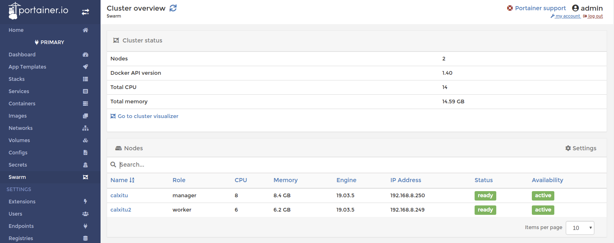

# Docker service

Un servei de docker és l'equivalent als docker containers peró utilitzant el desplegament sobre un docker swarm. És a dir, en comptes de desplegar una aplicació sobre una màquina en concret, si es desplega en un swarm, l'aplicació es desplegarà sobre totes les màquines de les que consti el swarm. D'aquesta manera l'aplicació es desplegarà en el que s'anomena rèplica. 

Els serveis son una capa superior que poden gestionar un contenidor replicat a diferents nodes d'un swarm. Es planteja el següent esquema : 

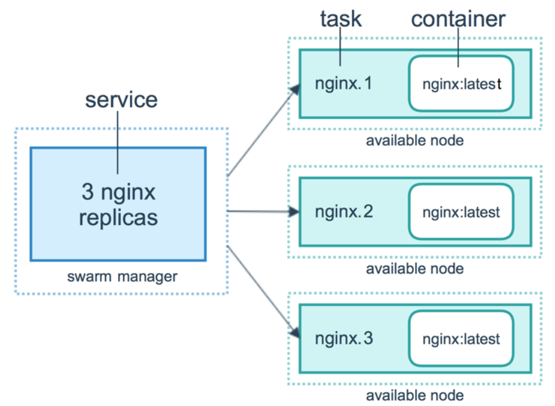

Els serveis utilitzen el que s'anomenen tasques, una tasca és la unitat atòmica que pot ser programada per execució en un swarm. Quan es genera un servei es genera també una programació (scheduling) de les tasques que han d'aparèixer en aquest servei. Els nodes Manager del swarm son els encarregats de gestionar les tasques del servei i de repartir-les en els diferents nodes worker del swarm. 

## Generem un servei docker

Utilitzarem el blockchain creat en 200 linies de codi que es va fer servir a l'assignatura de configuració de xarxes i serveis d'internet. 

Els serveis es creen a partir de imatges de docker. La idea és la mateixa que amb els contenidors, s'utilitza el codi per generar la imatge i tot seguit a partir de la imatge es genera el servei que es vulgui tenir en marxa. 

**Ens descarreguem el repositori a la màquina host manager**

```
git clone git@github.com:raikkon88/naivechain.git
```

**DockerFIle** 

```
$ cat Dockerfile 
FROM node:11.10

RUN mkdir /naivechain
ADD package.json /naivechain/
ADD main.js /naivechain/

RUN cd /naivechain && npm install

EXPOSE 3001
EXPOSE 6001

ENTRYPOINT cd /naivechain && npm install && PEERS=$PEERS npm start
```

Les instruccions del dockerfile, per aquest ordre son : 

- Instal·lem el node 11.10
- Creem un directori dins del docker que es dirà naivechain
- Hi posem el package.json i el main.js a dins
- Fem npm install dins del directori
- Obrim els ports (exposem) 3001 per el web service i 6001 per les connexions websocket
- Posem en marxa l'aplicació. 

Amb aquest dockerfile el que es fa és crear la imatge per executar només la part backend, és a dir el webservice fet amb nodejs que també incorpora la part websockets. 

**Es fa el docker build** 

El docker build genera la imatge que posteriorment serà utilitzada com a servei. Veiem una foto del procés de creació de la imatge on el mateix docker s'ho pentina per poder descarregar, extreure i instal·lar les diferents llibreries que requereix l'aplicació per funcionar.  

```
$ docker build . --tag node-naive --build-arg VER=0.1
Sending build context to Docker daemon  1.104MB
Step 1/8 : FROM node:4.6
4.6: Pulling from library/node
386a066cd84a: Pull complete 
75ea84187083: Pull complete 
88b459c9f665: Pull complete 
1e3ee139a577: Downloading [====================================>              ]  95.12MB/129.8MB
f78ff7d0315b: Download complete 
f4ba677961ff: Download complete 
21db8c3555aa: Download complete 
```

El resultats de la instrucció build : 

```
$ docker build . --tag node-naive --build-arg VER=0.1
Sending build context to Docker daemon  1.104MB
Step 1/8 : FROM node:11.10
11.10: Pulling from library/node
22dbe790f715: Pull complete 
0250231711a0: Pull complete 
6fba9447437b: Pull complete 
c2b4d327b352: Pull complete 
270e1baa5299: Pull complete 
08ba2f9dd763: Pull complete 
46f93ceb7fa9: Pull complete 
feae7733c66b: Pull complete 
Digest: sha256:064e5cd024878466b7de0d9fdc2ac5f79d5f526a5b6fe53ad8ab2cd3b3589418
Status: Downloaded newer image for node:11.10
 ---> a0d7a409d125
Step 2/8 : RUN mkdir /naivechain
 ---> Running in 105e2d596379
Removing intermediate container 105e2d596379
 ---> 5349bab7c84c
Step 3/8 : ADD package.json /naivechain/
 ---> 22498e6c72cf
Step 4/8 : ADD main.js /naivechain/
 ---> 851ecddabb11
Step 5/8 : RUN cd /naivechain && npm install
 ---> Running in d356cf6037b0
npm notice created a lockfile as package-lock.json. You should commit this file.
npm WARN naivechain@1.0.0 No description
npm WARN naivechain@1.0.0 No repository field.
npm WARN naivechain@1.0.0 No license field.

added 56 packages from 42 contributors and audited 165 packages in 6.736s
found 0 vulnerabilities

Removing intermediate container d356cf6037b0
 ---> 8330989ddd43
Step 6/8 : EXPOSE 3001
 ---> Running in eb3aa8e07d4a
Removing intermediate container eb3aa8e07d4a
 ---> e71f4ca275a9
Step 7/8 : EXPOSE 6001
 ---> Running in f0600c8e256d
Removing intermediate container f0600c8e256d
 ---> 73f9e0f4bcb0
Step 8/8 : ENTRYPOINT cd /naivechain && npm install && PEERS=$PEERS npm start
 ---> Running in bafb90e899fa
Removing intermediate container bafb90e899fa
 ---> a99c4666d17c
[Warning] One or more build-args [VER] were not consumed
Successfully built a99c4666d17c
Successfully tagged node-naive:latest
```

En aquest moment hem generat la imatge per poder tenir la imatge des de la que aixecarem el servei. Si mirem les imatges que tenim actualment podem veure com entre elles hi ha la imatge del nodejs versió 11.10 i la que hem creat última.

```
$ docker image ls
REPOSITORY            TAG                 IMAGE ID            CREATED             SIZE
node-naive            latest              a99c4666d17c        54 seconds ago      908MB
portainer/agent       <none>              5b96aa0902cb        5 weeks ago         13.9MB
mongo                 latest              f7adfc4dbcf5        3 months ago        413MB
portainer/portainer   latest              2b4ddf654e1c        4 months ago        77.7MB
openjdk               11-oraclelinux7     680c5ad86000        7 months ago        464MB
node                  11.10               a0d7a409d125        8 months ago        904MB
```

**Creació del docker service** 

Per crear el servei s'ha d'utilitzar la instrucció docker service create [4]. S'utilitza a la guia de creació de serveis docker [5]. 

A l'hora de crear el servei s'ha de saber quin és el nom de la imatge que s'ha de fer servir. En aquest cas, la imatge l'hem creat amb el nom de node-naive, per tant aquest és el nom de la imatge que farem servir a l'hora de crear el servei. 

```
$ docker service create node-naive
y141pg8oxowxyhx4sa8bqd36o
overall progress: 1 out of 1 tasks 
1/1: running   [==================================================>] 
verify: Service converged 
```

Ens comunica que el servei ha convergit, el següent pas és verificar el funcionament. Per fer-ho la primera instrucció que hem de tenir en compte és el docker service ls. 

```
$ docker service ls
ID                  NAME                  MODE                REPLICAS            IMAGE                        PORTS
qyfitwk4fith        portainer_agent       global              2/2                 portainer/agent:latest       
rjtjv0sghoxg        portainer_portainer   replicated          1/1                 portainer/portainer:latest   *:8000->8000/tcp, *:9000->9000/tcp
y141pg8oxowx        xenodochial_moore     replicated          1/1                 node-naive:latest            
```

Veiem que tenim els serveis del portainer juntament amb el servei xenodochial_moore, que és el nom que se li ha assignat (aleatori), que parteix de la imatge node-naive. 

El funcionament també es pot verificar mitjançant el portainer. 

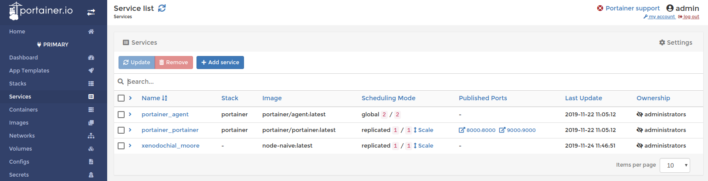

Veiem com el servei està en marxa en la nostre infraestructura docker. 

## Configuració del servei

Tot seguit, ja que anteriorment no s'ha fet, s'ha de publicar els ports amb els que treballa el docker. Docker service amb swarm utilitzen un servei de meshing (router) anomenat Ingress. A l'hora de configurar un docker service es pot fer directament contra el host (ocupant un port del host) o utiltizant el servei Ingress encarregat del NAT i encarregat de redirigir les diferents requests a l'interior dels nodes. En aquest cas nosaltres utiltizem el servei de mesh comunicant que el port de la màquina 3001 ha de mapejar contra el port 3001 del docker. Se li pot afegir directament mitjançant el portainer o bé actualitzant el servei. 

Farem el mateix amb el port 6001. 

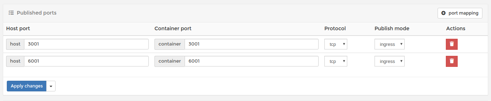

Verifiquem que els ports s'han obert correctament i que estan mapejant la màquina host amb la màquina guest. Es pot verificar a les últimes línies de la següent instrucció. 

```
$ docker service inspect xenodochial_moore --pretty

ID:		y141pg8oxowxyhx4sa8bqd36o
Name:		xenodochial_moore
Service Mode:	Replicated
 Replicas:	1
UpdateStatus:
 State:		updating
 Started:	3 seconds ago
 Message:	update in progress
Placement:
UpdateConfig:
 Parallelism:	1
 On failure:	pause
 Monitoring Period: 5s
 Max failure ratio: 0
 Update order:      stop-first
RollbackConfig:
 Parallelism:	1
 On failure:	pause
 Monitoring Period: 5s
 Max failure ratio: 0
 Rollback order:    stop-first
ContainerSpec:
 Image:		node-naive:latest
 Init:		false
Resources:
Endpoint Mode:	vip
Ports:
 PublishedPort = 3001
  Protocol = tcp
  TargetPort = 3001
  PublishMode = ingress
 PublishedPort = 6001
  Protocol = tcp
  TargetPort = 6001
  PublishMode = ingress 
```

Un cop feta la redirecció dels ports podem accedir a la cadena mitjançant el web service. 

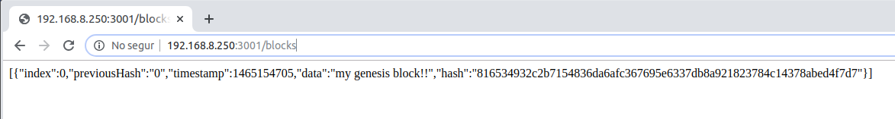

# Control de repliques

Tal i com s'ha comentat anteriorment a l'apartat TIER, tot aquest sistema està pensat per què sigui senzill la configuració del datacenter per poder aconseguir entre altres coses l'alta disponibilitat. En aquest moment el nostre servei està en marxa a la màquina Host. 

Podem veure a la imatge següent quin és l'estat de les màquines i quins son els contenidors o serveis que estan corrent a la vegada. 

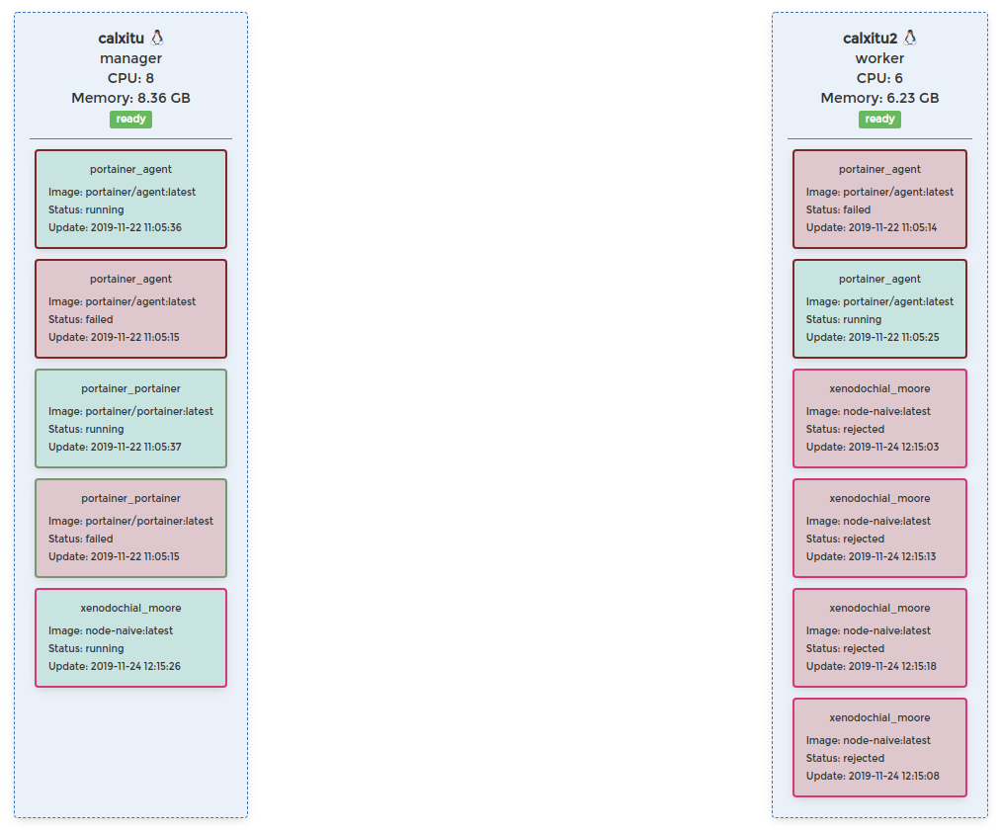

Distingim que el servei xenodochial_moore no està executant-se a la màquina worker (calxitu2) sinó que el seu estat és rejected. Fent ús de la instrucció docker ps podem veure l'estat de les tasques que s'han repartit i si hi ha hagut algun error les raons d'aquest error. 

```
$ docker service ps --no-trunc xenodochial_moore
ID                          NAME                      IMAGE               NODE                DESIRED STATE       CURRENT STATE            ERROR                                PORTS
ar42pgj3t5krg7eew7rczcmkk   xenodochial_moore.1       node-naive:latest   calxitu             Running             Running 3 minutes ago                                         
d4ltiwve0lzschdpnhslvppkg    \_ xenodochial_moore.1   node-naive:latest   calxitu2            Shutdown            Rejected 4 minutes ago   "No such image: node-naive:latest"   
ax55hoj6d7ltqkw2ip4vqz12u    \_ xenodochial_moore.1   node-naive:latest   calxitu2            Shutdown            Rejected 4 minutes ago   "No such image: node-naive:latest"   
yr42oidg35tkfww7p39vaewxg    \_ xenodochial_moore.1   node-naive:latest   calxitu2            Shutdown            Rejected 4 minutes ago   "No such image: node-naive:latest"   
609vbwnbzvy37awtojpx646cx    \_ xenodochial_moore.1   node-naive:latest   calxitu2            Shutdown            Rejected 4 minutes ago   "No such image: node-naive:latest"  
```

Veiem que l'error és molt clar, ens marca rejected per què no ha trobat la imatge del docker que ha de fer servir per poder replicar el contenidor a l'altre node del cluster. 

Docker controla les imatges de manera local si no se li diu el contrari. De fet, docker utiltiza el docker registry, que és un repositori d'imatges docker alimentat de manera global amb els servidors de docker. En aquest cas, la imatge que s'ha creat de manera local al host calxitu.ddns.net no hi és al repositori global.

El repte doncs és aconseguir replicar aquestes imatges al llarg de la xarxa de workers docker sense fer ús del registre global que ens proporciona el mateix docker. El procediment serà fer ús de docker save i docker load per poder desar les imatges com a fitxers tar i per importar-los, veiem [6]. 

## Replicar la imatge a un node

Aquesta acció en linux es pot realitzar mitjançant la concatenació de les intruccions docker save, bzip2, pv i ssh. La instrucció pv no és necessària peró és útil per tenir una idea del progrés de la tasca, aquesta instrucció ens permet auditar el temps de transacció dels fitxers mitjançant ssh. 

**Configurar agent ssh**

El primer que s'ha de fer és generar un parell de claus per habilitar la comunicació entre el node manager i el node worker. Per fer-ho i per simplicitat anomenarem el node worker calxitu2.ddns.net i ho deixarem al /etc/hosts. En el nostre cas aquest node és el que té la ip 192.168.8.249/24. 

1. Fitxer hosts : 

```
$ cat /etc/hosts
127.0.0.1	localhost.localdomain	localhost	calxitu.ddns.net
::1		localhost6.localdomain6	localhost6
192.168.8.249	calxitu2.ddns.net
```

2. Generem el parell de claus : 

```
$ ssh-keygen -t rsa -b 4096
Generating public/private rsa key pair.
Enter file in which to save the key (/home/marc/.ssh/id_rsa): id_calxitu2
Enter passphrase (empty for no passphrase): 
Enter same passphrase again: 
Your identification has been saved in id_calxitu2.
Your public key has been saved in id_calxitu2.pub.
The key fingerprint is:
SHA256:olxCHLdNDZlDO6dY8Pla6j4Njo5/XeBZkAmQcyjQz0A marc@calxitu
The key's randomart image is:
+---[RSA 4096]----+
|  .+E +==* o     |
|   .+o+*=o=      |
|    o=.oB...     |
|   .  oo =. .    |
|    . + S.o+     |
|   . + ..+o .    |
|    o  oo+ .     |
|     ...+ o      |
|    .oooo.       |
+----[SHA256]-----+
```

3. Copiem la clau pública al node worker. 

```
$ ssh-copy-id -i id_calxitu2.pub marc@calxitu2.ddns.net
/usr/bin/ssh-copy-id: INFO: Source of key(s) to be installed: "id_calxitu2.pub"
The authenticity of host 'calxitu2.ddns.net (192.168.8.249)' can't be established.
ECDSA key fingerprint is SHA256:DXfJmstMq03zt5qqy/H1RyfImgHRnoTCi8WlGXwWnrI.
Are you sure you want to continue connecting (yes/no)? yes
/usr/bin/ssh-copy-id: INFO: attempting to log in with the new key(s), to filter out any that are already installed
/usr/bin/ssh-copy-id: INFO: 1 key(s) remain to be installed -- if you are prompted now it is to install the new keys
marc@calxitu2.ddns.net's password: 

Number of key(s) added: 1

Now try logging into the machine, with:   "ssh 'marc@calxitu2.ddns.net'"
and check to make sure that only the key(s) you wanted were added.
```

4. Configurem el fitxer config d'ssh per la comunicació entre les màquines. 

```
$ cat ~/.ssh/config 
Host calxitu2.ddns.net
	IdentityFile ~/.ssh/id_calxitu2
	Hostname calxitu2.ddns.net
```

5. Copiem la imatge utilitzant la instrucció docker save

```
$ docker save node-naive | bzip2 | pv | ssh calxitu2.ddns.net "cat > ~/node-naive" 
 287MiB 0:03:09 [1,52MiB/s] [                                                                  <=>                                                     ]
```

6. Verifiquem que la imatge s'ha transmés correctament 

```
marc@calxitu2:~$ ls -la | grep node-naive 
-rw-rw-r-- 1 marc marc 301628301 nov 24 11:48 node-naive
```

7. Importem la imatge 

```
marc@calxitu2:~$ docker load -i ~/node-naive
5bb0785f2eee: Loading layer  105.5MB/105.5MB
a327787b3c73: Loading layer  24.08MB/24.08MB
f3a38968d075: Loading layer  8.005MB/8.005MB
3443d6cf0f1f: Loading layer  146.4MB/146.4MB
7de462056991: Loading layer  576.4MB/576.4MB
909542b1bce2: Loading layer  349.2kB/349.2kB
379713b03c5c: Loading layer  66.81MB/66.81MB
bc0967357765: Loading layer  5.087MB/5.087MB
c824e81bdf78: Loading layer  2.048kB/2.048kB
430e64a4d460: Loading layer   2.56kB/2.56kB
85d91674ccdb: Loading layer  10.24kB/10.24kB
63ca2c4bd289: Loading layer  4.958MB/4.958MB
Loaded image: node-naive:latest
```

8. Verifiquem que el node worker té la imatge. 

```
marc@calxitu2:~$ docker image ls
REPOSITORY          TAG                 IMAGE ID            CREATED             SIZE
node-naive          latest              a99c4666d17c        About an hour ago   908MB
portainer/agent     <none>              5b96aa0902cb        5 weeks ago         13.9MB

```

Per poder afegir l'escalat del servei, és a dir una nova rèplica en el node calxitu2 hem d'actuar sobre el valor replica del mateix servei. 

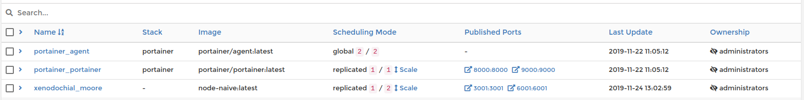

Tot seguit podem veure com el node intenta replicar-se. 

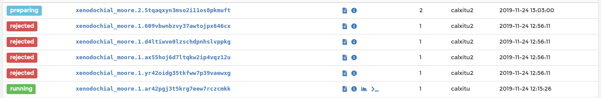

Ara hem de tenir paciència fins que finalitzi. 

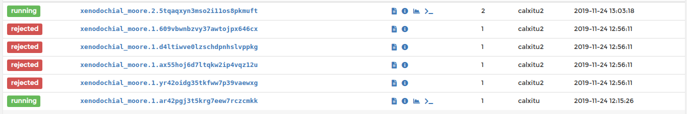

En aquest moment tenim un node replicat a la xarxa, és a dir, totes les requests que es dirigeixin al servei node-naive seràn balancejades entre els diferents nodes, en aquest cas el node manager i el node worker. També cada cop que es realitzi un canvi al node manager o al node worker, automàticament docker repartirà el canvi per les diferents rèpliques. 

Veiem el funcionament del cluster amb el cluster visualizer del portainer

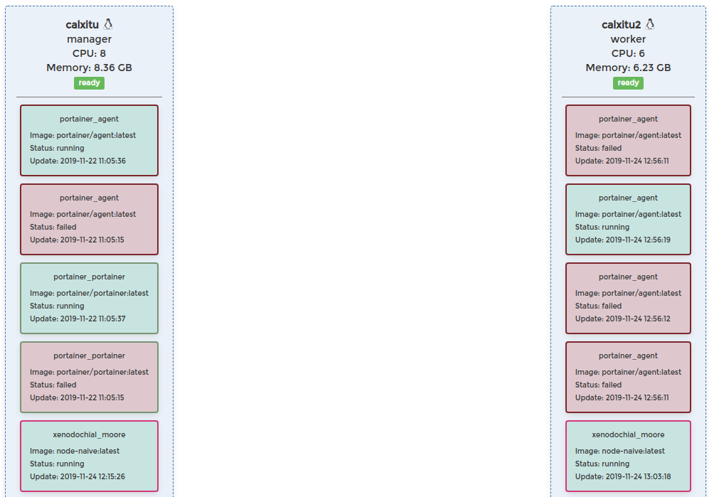

Veiem el resultat de demanar tant a un node com a l'altre.

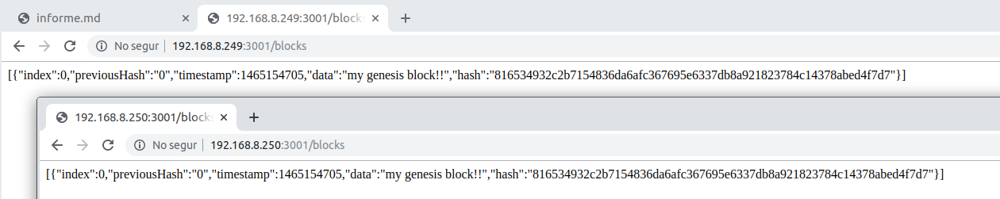

# Conclusions

Anteriorment s'ha parlat de docker images, docker containers i de docker networks. En aquest episodi s'ha parlat de docker swarm i docker service, també s'ha comentat l'utilitat de les rèpliques i del servei de docker. S'ha parlat dels TIER i de la usabilitat que tenen. S'ha comentat com ho fa docker per poder replicar les imatges si no tenim un registre. 

En general s'ha utiltizat el paràmetre --help a totes les instruccions de docker abans de fer-les per poder tenir una claretat del que s'està fent, és per aquest motiu que no hi ha un nombre excessiu de referències. Les referències s'han fet servir més aviat per a les conclusions conceptuals. 

# Referències 

- [1] - Docker Swarm : [https://docs.docker.com/engine/swarm/key-concepts/](https://docs.docker.com/engine/swarm/key-concepts/)
- [2] - Docker swarm init : [https://docs.docker.com/engine/reference/commandline/swarm_init/](https://docs.docker.com/engine/reference/commandline/swarm_init/)
- [3] - ANSI/TIA-942 : [https://en.wikipedia.org/wiki/TIA-942](https://en.wikipedia.org/wiki/TIA-942)
- [4] - Docker service Create : [https://docs.docker.com/v17.09/engine/reference/commandline/service_create/](https://docs.docker.com/v17.09/engine/reference/commandline/service_create/)
- [5] - Guia de creació de serveis docker : [https://docs.docker.com/engine/swarm/services/](https://docs.docker.com/engine/swarm/services/) 
- [6] - Sharing docker images without a registry : [https://stacktoheap.com/blog/2015/11/22/sharing-docker-images-without-registry/](https://stacktoheap.com/blog/2015/11/22/sharing-docker-images-without-registry/)